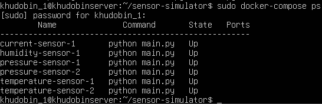
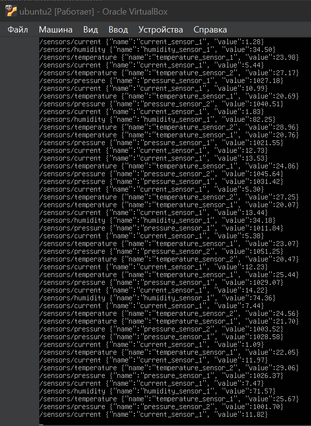
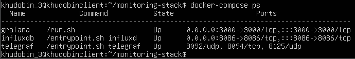
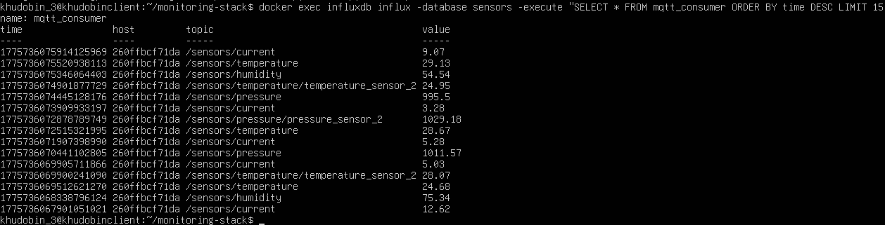
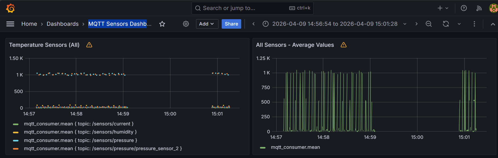
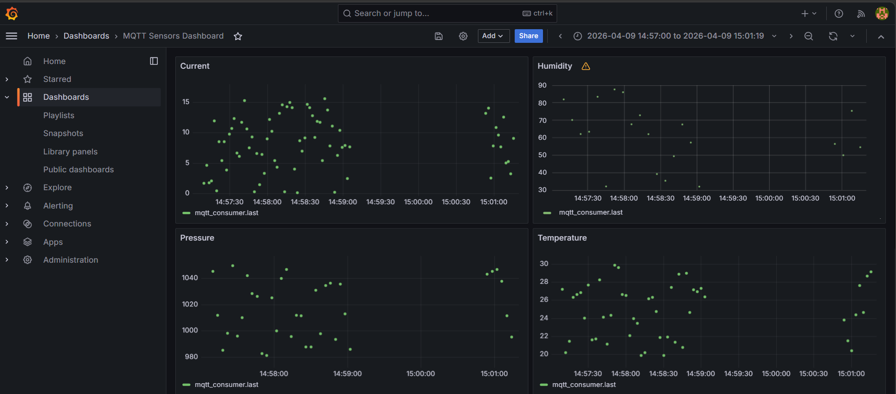

# Отчет по практической работе 

Развертывание системы сбора и визуализации данных на базе Docker, MQTT, InfluxDB, Telegraf и Grafana

Описание проекта:
Симуляторы сенсоров, развернутые в докер контейнерах, публикуют сообщения на Mqtt брокер. Сервис Consumer подписывается на все сообщение, опубликованные в брокере, и заносит их в базу данных временных рядов. Сервис dashboard отображает графики полученных данных от сервисов.
# Предварительные требования

Для выполнения практической работы №2 были:
- Использованы три виртуальные машины из прошлой практики: Linux A, Linux B и Linux C.
- Установлены docker и docker compose на каждую ВМ
- Создана ветка develop в репозитории;
# Linux A (Client)


Перед запуском контейнера, следует отредактировать конфигурационный файл (.env), лежащий в директории vms/client/simulator. В нем необходимо указать свою дату рождения

После этого запустите виртуальную машину и перейдите в рабочую директорию:
```
cd /репозиторий/vms/client/simulator
```
Запустите контейнеры:
```
sudo docker-compose up -d
```
Посмотрите контейнеры с помощью команды:
```
sudo docker-compose ps
```




# Linux B
_________
Запустите контейнер broker:
```
sudo docker-compose up -d
sudo docker-compose ps 
```
Проверим с помощью команды:
```
docker exec -it mosquitto-broker mosquitto_sub -h localhost -t "#" -v
```

# Linux C

Запустите виртуальную машину и перейдите в рабочую директорию:
```
cd /репозиторий/vms/server
```

Запустите контейнер:

```
sudo docker-compose up -d
```

Посмотрите контейнеры:
```
sudo docker-compose ps
```

База данных создается следующим образом:

```
sudo docker exec -it influxdb influx
```

```
create database sensors
create user telegraf with password 'telegraf' with all privileges
show users

exit
```


Можно просмотреть данные с помощью следующей команды:
```
docker exec influxdb influx -database sensors -execute "SELECT * FROM mqtt_consumer ORDER BY time DESC LIMIT 15"
```




# Проверка работы

1. На запущенной ВМ Linux C узнайте IP (Сетевой мост);
2. Откройте браузер (Например, Google Chrome);
3. Перейдите по следующему адресу Grafana: http://<IP_Linux_C_сетовой мост>:3000;
4. Перейдя по ссылке, Вам нужно ввести логин и пароль (admin/admin);
5. Перейдите в  раздел Dashboards:
6. Откройте его:
7. Перейдите в дашборд "MQTT Sensors Dashboard": 

8. Готовый результат:

